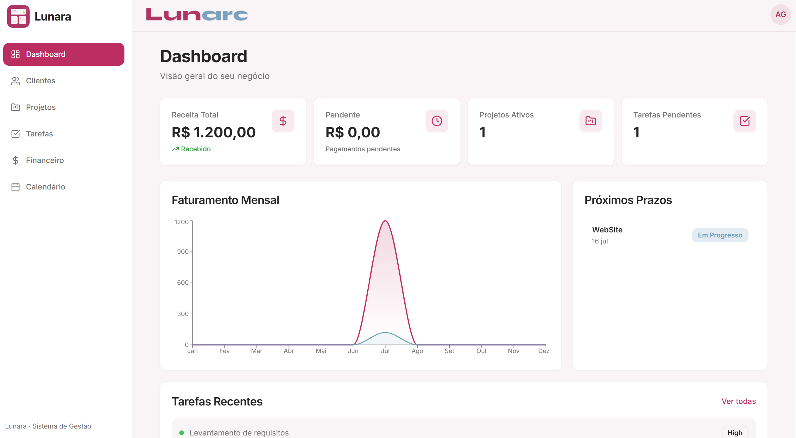
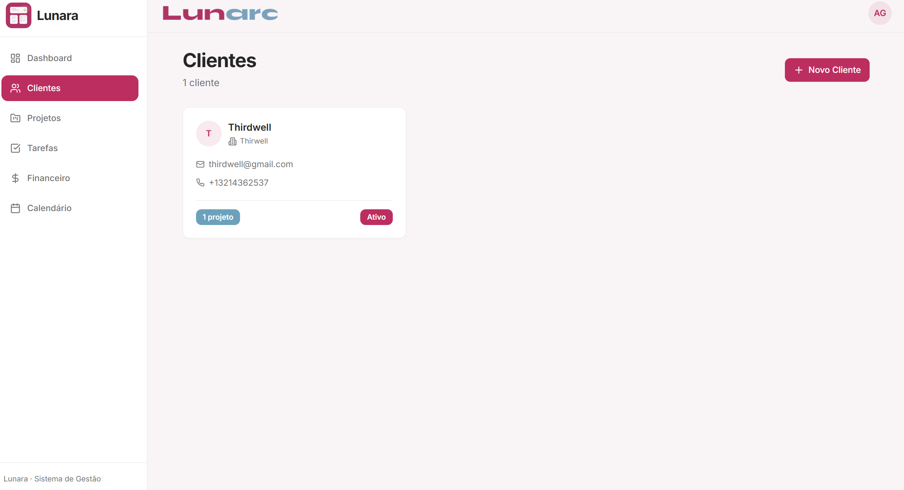
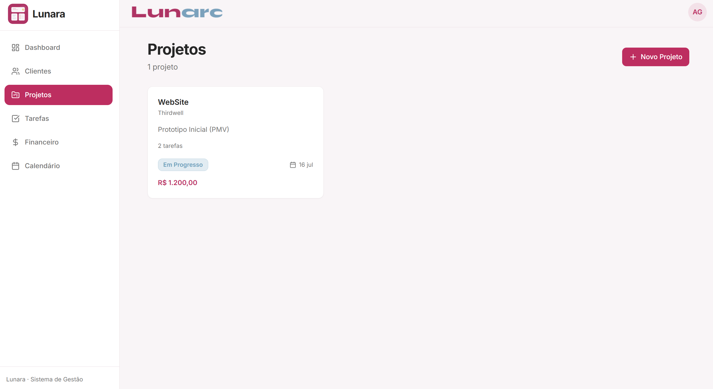
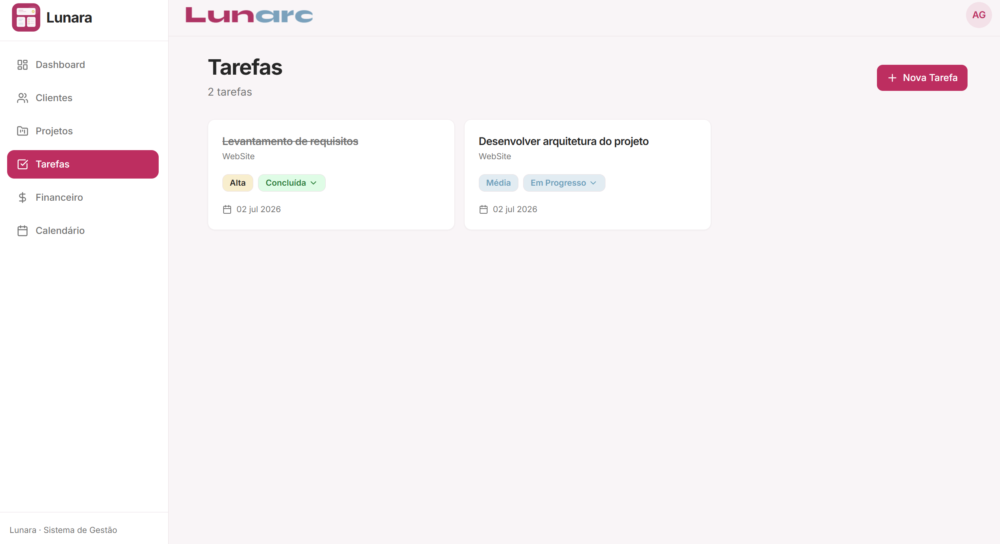
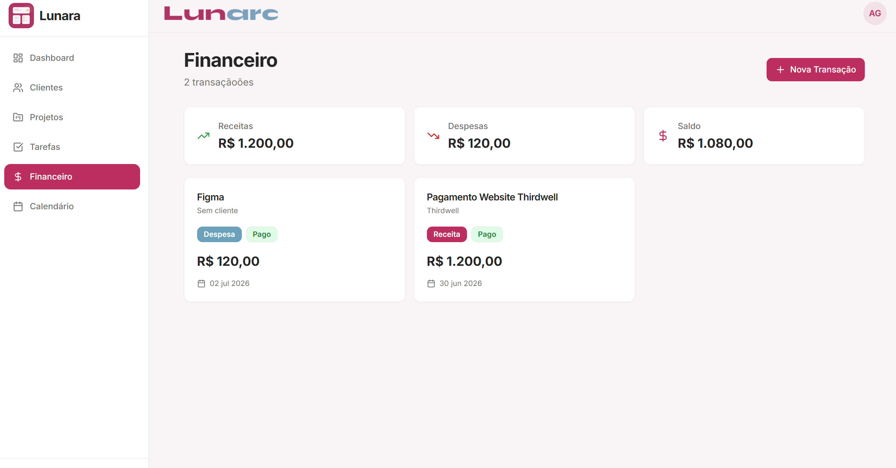
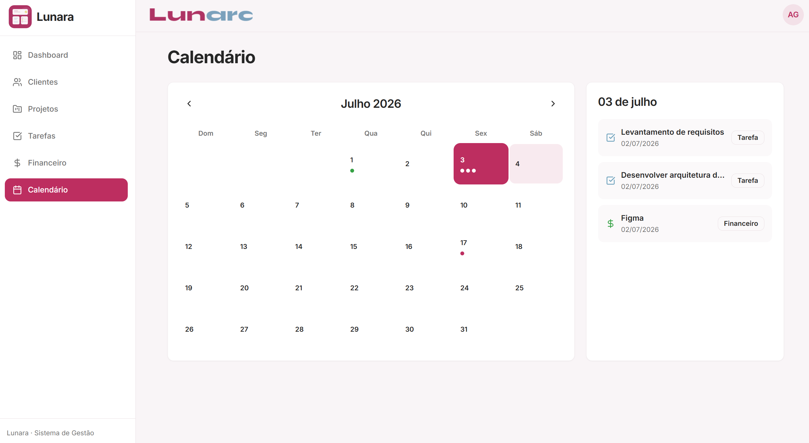
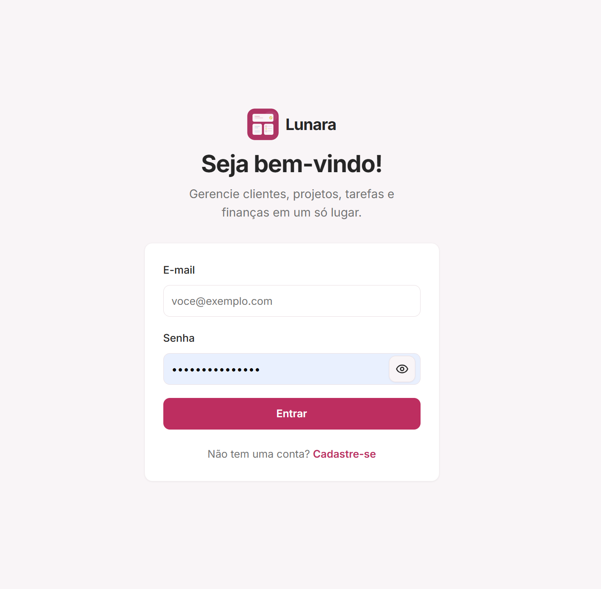

# Lunara

Lunara is a management application for freelancers, created to centralize clients, projects, tasks, finances, and deadlines in a single workspace.

The project was developed as a complete product, with authentication, real data persistence, user-based data isolation, Firestore security rules, responsive interface, web/PWA version, and desktop packaging with Tauri.

Lunara’s purpose is to help freelancers better organize their professional routine, reducing information fragmentation and making it easier to track ongoing work.

## Main Links

Web application:  
[access web version](https://app-lunara.vercel.app/login)

Windows desktop app:  
[download installer](Lunara_0.1.0_x64-setup.exe)

Technical documentation:

- [Lunara Architecture](docs/architecture.md)
- [Firebase and Data Security](docs/firebase-security.md)
- [Desktop Build with Tauri](docs/tauri-build.md)

## Project Context

Lunara was created from a practical need: organizing freelance work in one place.

Before developing the app, important information such as client details, project status, pending tasks, deadlines, and financial values was spread across different places. This meant that part of the work time was being spent just looking for information before even starting or continuing a delivery.

The idea behind Lunara was to turn this workflow into a more organized experience. The app brings together the main areas of a freelancer’s routine into a single product, allowing users to track their projects, clients, tasks, finances, and deadlines with more clarity.

## Features

Lunara includes:

- user sign-up and login;
- client management;
- project management;
- task organization;
- income and expense tracking;
- deadline tracking through a calendar;
- dashboard with general indicators;
- user-based data isolation;
- responsive interface for desktop and mobile;
- published web version;
- PWA configuration;
- Windows desktop version with installer.

## Technologies Used

- React
- TypeScript
- Vite
- Tailwind CSS
- Firebase Authentication
- Cloud Firestore
- TanStack Query
- Tauri
- Vercel

## Screenshots

<p align="center">
  
</p>

<p align="center">
  
</p>

<p align="center">
  
</p>

<p align="center">
  
</p>

<p align="center">
  
</p>

<p align="center">
  
</p>

<p align="center">
  
</p>

## Repository Structure

This repository does not expose the full application source code.

The purpose of this repository is to present Lunara as a portfolio case study, showing documentation, technical decisions, screenshots, and selected code samples without making the complete product codebase public.

```txt
Lunara-App/
├─ README.md
├─ photos/
├─ clients/
├─ finance/
├─ firebase/
├─ layout/
├─ projects/
├─ shared/
├─ Login.tsx
├─ useAuth.tsx
├─ Architecture.md
├─ Firebase-security.md
└─ Tauri-build.md
```
Sensitive files, environment variables, final builds, private configuration, and the complete application source code are not included in this repository.

## Technical Decisions

Some important technical decisions in Lunara include:

- using Firebase Authentication for sign-up and login;
- using Cloud Firestore for real data persistence;
- organizing data by authenticated user;
- using the Firebase `uid` to separate each account’s information;
- configuring Firestore security rules;
- using TanStack Query to manage asynchronous data;
- building a responsive interface for desktop and mobile;
- deploying the web version on Vercel;
- configuring the project as a PWA;
- packaging the desktop version with Tauri.

## Data Security

Lunara uses a user-based data structure.

The data is organized like this:

```txt
users/{uid}/clients
users/{uid}/projects
users/{uid}/tasks
users/{uid}/transactions
```

This structure ensures that clients, projects, tasks, and financial transactions are linked to the authenticated user.

In addition, Firestore rules were configured to allow each user to access only the documents inside their own `uid`.

This was one of the most important decisions in the project, because it turns Lunara into a safer multi-user application that is more consistent with a real usage scenario.

## Desktop Version

In addition to the web and PWA versions, Lunara was also packaged as a Windows desktop application using Tauri.

The desktop version uses the same front-end developed with React, TypeScript, and Vite. Tauri uses the build generated by Vite and creates a Windows `.exe` installer.

This decision expands the product’s distribution options and shows that the application was designed to run beyond the browser.

## User Testing

After the web version was published, Lunara was shared with real users for an initial experience validation.

This stage helped identify problems and improvements that are not always clear during individual development, such as usage questions, behavior on different devices, and small interface adjustments.

The bugs and improvements reported by users were analyzed and fixed as testing progressed. This process helped make the app more consistent and closer to real use.

## Challenges Faced

During development, some of the main challenges were:

- structuring the project as a real multi-user application;
- ensuring that each user could only access their own data;
- correcting the initial global collection structure in Firestore;
- configuring appropriate security rules;
- keeping the interface functional and comfortable on desktop and mobile;
- fixing bugs identified by real users;
- adjusting the React/Vite deployment on Vercel;
- configuring the project as a PWA;
- adapting the web app to the desktop environment with Tauri;
- configuring CSP to allow communication with Firebase in the desktop app.

## Local Execution Note

This repository does not contain the complete application source code. Because of that, cloning this repository does not allow Lunara to run locally.

This decision was made to protect the complete product structure, avoid exposing sensitive files, and keep the public repository focused on technical presentation, documentation, and case study content.

To access the product, use the web version link or the desktop installer available in the Release.

## Additional Documentation

To better understand the project decisions, see:

- [Lunara Architecture](Architecture.md) — explanation of Lunara’s general architecture;
- [Firebase and Data Security](Firebase-security.md) — explanation of authentication, Firestore, and data isolation;
- [Desktop Build with Tauri](Tauri-build.md) — explanation of the desktop packaging with Tauri.

## Contact

To see other projects, experience, and professional information, visit my profiles:

LinkedIn: [Alice Gama](https://www.linkedin.com/in/alice-gama-75913022a/)

Portfolio: [Alice Gama-Software Engineer](https://dev-portfolio-two-lovat-95.vercel.app/)

GitHub: [gamaalice](https://github.com/gamaalice)
